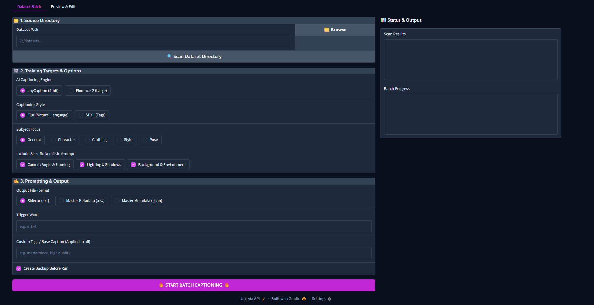
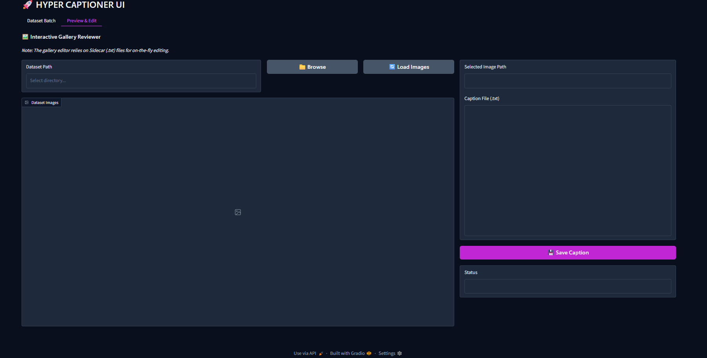
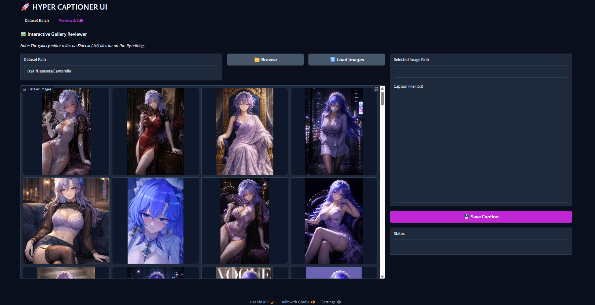

# 🚀 Hyper Captioner

## Main Interface



## Preview & Edit



## Loaded Preview



**Hyper Captioner** is an AI-powered image captioning tool designed for creating high-quality datasets for Image LoRA training.

It supports **JoyCaption (4-bit)** and **Florence-2 Large**, includes automatic dataset scanning, health checks, metadata export, and a built-in caption editor for reviewing captions before training.

---

# ✨ Features

- 🤖 JoyCaption (4-bit) Support
- 🌸 Florence-2 Large Support
- 🔍 Scan dataset for missing captions
- 🩺 Dataset health check
  - Corrupted image detection
  - Missing caption detection
  - Empty caption detection
- 💾 Automatic backup before captioning
- 🎯 Subject-aware caption generation
  - General
  - Character
  - Clothing
  - Style
  - Pose
- 📝 Multiple caption styles
  - Flux (Natural Language)
  - SDXL / Danbooru Tags
- ⚙️ Optional prompt enhancements
  - Camera Angle & Framing
  - Lighting & Shadows
  - Background & Environment
- 📂 Multiple output formats
  - Sidecar (.txt)
  - CSV Metadata
  - JSON Metadata
- 🖼️ Built-in Preview & Edit interface
- 📊 Live progress reporting

---

# 📦 Installation

Clone the repository

```bash
git clone https://github.com/Logg1101/Hyper-Captioner.git
cd Hyper-Captioner
```

Create a virtual environment

```bash
python -m venv venv
```

Activate it

### Windows

```bash
venv\Scripts\activate
```

### Linux / macOS

```bash
source venv/bin/activate
```

Install dependencies

```bash
pip install -r requirements.txt
```

---

# 🤖 Download Required Models

Hyper Captioner downloads models directly from Hugging Face.

Currently supported:

- JoyCaption (4-bit)
- Florence-2 Large

The first launch may take several minutes while models are downloaded.

---

# ▶ Launch

Run

```bash
python app.py
```

or

```bash
captioner.bat
```

---

# 📂 Recommended Dataset Structure

```
Dataset
│
├── image_001.png
├── image_002.png
├── image_003.jpg
└── ...
```

Hyper Captioner automatically creates matching caption files beside each image.

```
image_001.png
image_001.txt
```

---

# ⚠ Before Running

Before launching Hyper Captioner, make sure:

- Python is installed.
- All packages from `requirements.txt` are installed.
- You have a CUDA-compatible NVIDIA GPU if you intend to use GPU acceleration.
- Sufficient disk space is available for model downloads.
- Your dataset contains supported image formats:
  - PNG
  - JPG
  - JPEG
  - WEBP
  - BMP

---

# 📝 Notes

- The first launch is slower because AI models are downloaded and cached.
- Existing captions are skipped automatically.
- Backups can be created before captioning.
- Captions can be reviewed and edited using the Preview & Edit tab.

---

# ❤️ Support

Hyper Captioner is a personal project built to make Image LoRA dataset preparation faster and easier.

If it saves you time, helps with your workflow, or you simply enjoy using it, consider buying me a coffee.

Your support helps me continue improving the project and adding new features.

☕ **Buy me a coffee:**
paypal: ankitsinha1101@gmail.com

---

## License

MIT License
